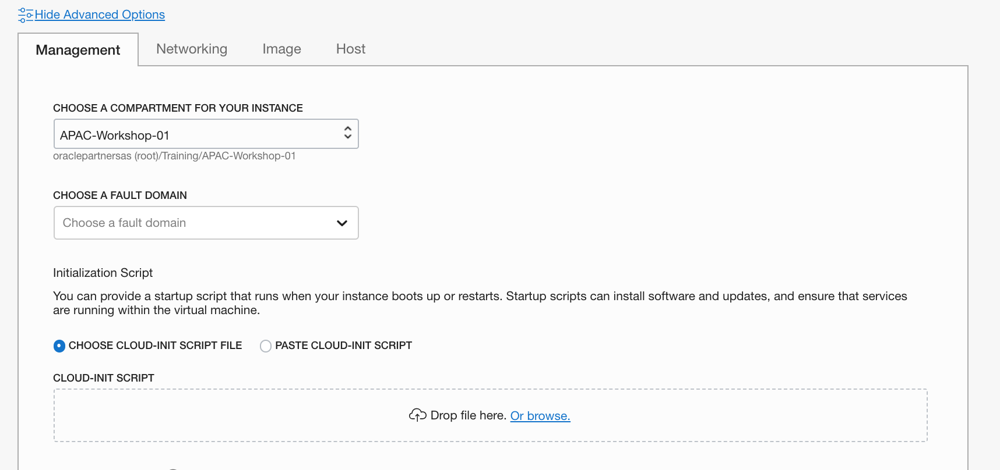

# Create a Database using the Custom image


## Download Marketplace Initialization Zip

1. Click [**here**](https://community.oracle.com/servlet/JiveServlet/download/1031489-6-462822/oci-db-app-script-examples.zip) to download the marketplace initialization zip file.
2. Save it to your downloads folder
3. Unzip the folder and locate the `StandardIO-db.cloud-init` file. You will need this later when you create your compute instance.


## Create Compute Instance

1. From OCI console, create a Compute Instance named **dbserver**.

2. Click Change Image, and select Oracle Images. Click the down arrow to select the database version.

3. Select the 19c version from the image build.

4. Scroll down, accept the standards and conditions and click the **Select Image** button.

5. Change VM Shape to VM.Standard2.2

6. Choose the VCN and the private subnet(*oke-subnet-quick-...*) same as the kubernetes cluster.

7. Add SSH Public Key, so the Database Host can by access by bastion host.

8. Click on **Show Advanced Options**. Choose the correct compartment. Click on the **Choose Cloud-Init Script File**. Click **browse**.

9. Select the extracted `StandardIO-cloud-init` script. There are multiple scripts dependent on the shape you want. For this lab, we will be using the Standard IO.

   

10. Click the **Create** button to create your instance. Your instance will be in the provisioning state for about 5 minutes. Verify that you chose the correct image. In a few minutes you can also verify that you have a public IP address. View the Work Requests at the bottom, this will show where your instance is.

11. Once the instance moves to the `Running` state, You can ssh access the dbserver from your bastion server. You need wait more time about 15 minutes until the database setup is ready. You can write down the information of your dbserver. For example:

    - Private IP address: 10.0.10.6
    - Host Name: dbserver.sub981952be8.mycluster.oraclevcn.com

    The default Database inforamation is:

    - SID: ORCL
    - CDB Servicename: ORCL
    - PDB Servicename: orclpdb
    - password: Ora_DB4U

12. From the bastion host, log into the database server, open the 1521 port

    ```
    [opc@oke-bastion ~]$ ssh -i labkey opc@10.0.10.6
    Last login: Fri Mar 27 05:24:22 2020 from oke-bastion.lbsubf4fedd375.mycluster.oraclevcn.com
    [opc@dbserver ~]$ sudo firewall-cmd --zone=public --add-port=1521/tcp --permanent
    success
    [opc@dbserver ~]$ sudo firewall-cmd --reload
    success
    [opc@dbserver ~]$ exit
    ```
    
    
    
13. Exit to the bastion host, install oracle instant client.

    ```
    $ sudo yum install oracle-release-el7
    $ sudo yum list oracle-instantclient*
    $ sudo yum install oracle-instantclient19.3-basic.x86_64 oracle-instantclient19.3-sqlplus.x86_64 oracle-instantclient19.3-tools.x86_64
    ```

     

14. Test the database.

    ```
    [opc@oke-bastion ~]$ sqlplus system/Ora_DB4U@10.0.10.6:1521/ORCL
    
    SQL*Plus: Release 19.0.0.0.0 - Production on Fri Mar 27 07:54:54 2020
    Version 19.5.0.0.0
    
    Copyright (c) 1982, 2019, Oracle.  All rights reserved.
    
    Last Successful login time: Fri Mar 27 2020 07:54:40 +00:00
    
    Connected to:
    Oracle Database 19c Enterprise Edition Release 19.0.0.0.0 - Production
    Version 19.5.0.0.0
    
    SQL> 
    ```

15. Enable Oracle Managed Files(OMF) for easy datafiles management.

    ```
    SQL> alter system set db_create_file_dest='/u01/app/oracle/oradata' scope=both;
    
    System altered.
    
    SQL> 
    ```

    

The database on the compute instance is ready